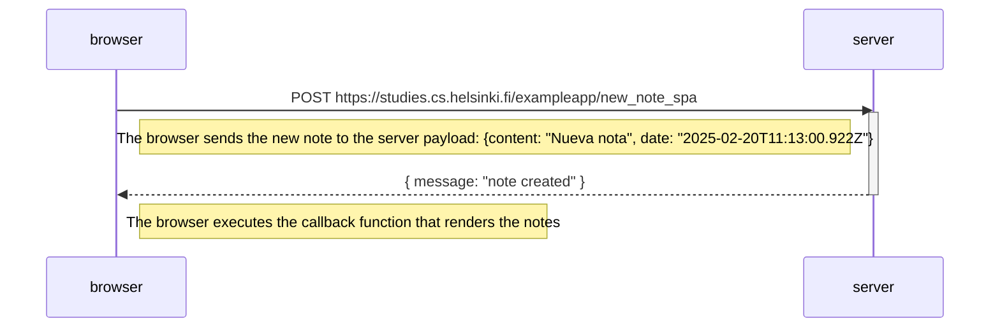

```mermaid
sequenceDiagram
	participant browser
	participant server

	browser ->> server: POST https://studies.cs.helsinki.fi/exampleapp/new_note_spa
	activate server
	Note right of browser: The browser sends the new note to the server payload: {content: "Nueva nota", date: "2025-02-20T11:13:00.922Z"}
	
	server -->> browser: { message: "note created" }
	deactivate server

	Note right of browser: The browser executes the callback function that renders the notes

```